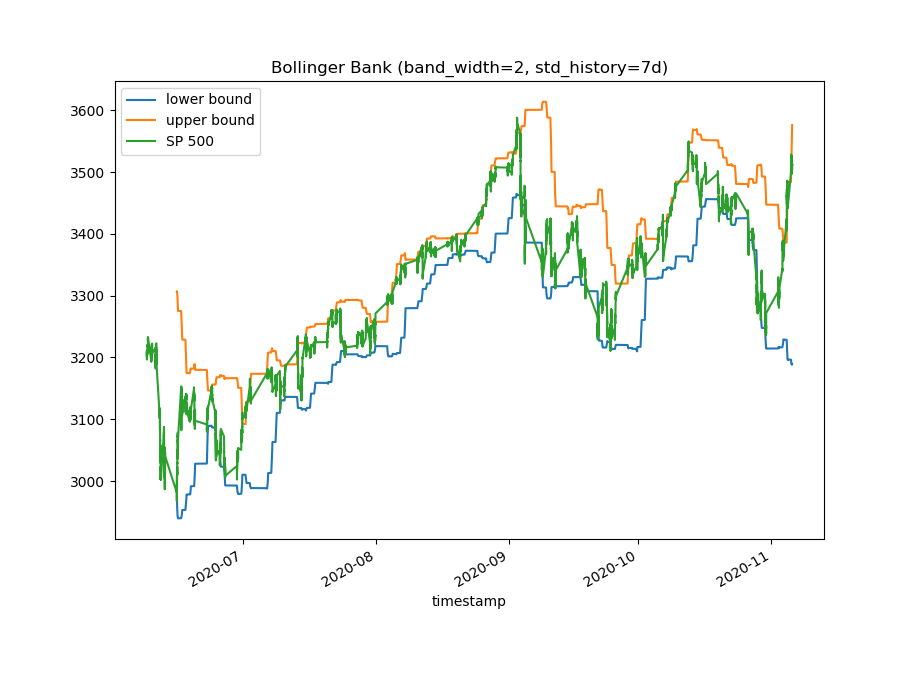

# Financial Market Alerts

The app sends emails when some market alerts are triggered.

The goal is the eventually have bunch of different types of alerts and even some very complex alerts,
e.g. alerts that trigger on acceleration factor.

### Currently supported alerts
1. Absolute threshold:
    1. Name: `abs_threshold`
    1. Parameters:
        1. `threshold`: alert triggers when `threshold` price is reached.
1. Percent change since last close:
    1. Name: `pct_last_close`
    1. Parameters:
        1. `threshold`: percentage change since last session close
        1. `sign`: optional. If `le` then the alert triggers only if price drops by at least `-threshold`,
        if `ge` then the alert triggers only if price increases by at least `+threshold`. Otherwise the alert
        triggers in both directions.
1. All-time high/low:
    1. Name: `all_time_hilo`
    1. Parameters: no parameters
    1. Note: currently it is not actually comparing to all-time, but to all-available data
1. [Bollinger Band](https://en.wikipedia.org/wiki/Bollinger_Bands)
    1. Name: `bollinger_band`
    1. Parameters:
        1. `band_width`: describes how many standard deviations should the bands be away from the mean.
        Example values: 1,2,3.... Default is 2.
        1. `std_history`: time-range used to estimate the standard deviation. 
        Example value `7d` means that last 7 days will be used to get the standard deviation of prices.
        Default is `7d`.
    1. Description: alert triggers when prices crosses lower or upper bound. See example below.
    1. Example of the Bollinger Bands on S&P 500 index:
    
1. Crossing Moving Averages (MA)
    1. Name: `crossing_moving_average`
    1. Parameters:
        1. `short_window`: time-range used to calculate more recent moving average. E.g. `7d`
        1. `long_window`: time-range used to calculate more long-term moving average. E.g. `14d`
        1. `threshold`: value by which long- and shor-window MAs must differ in order to trigger and alert.
    1. Description: alert triggers when short-window MA crosses the long-window MA and 
    has a difference of at least `threshold`
    1. Example plot of 7 and 14 days moving averages of S&P 500 index:
    
    
### Currently supported data downlaoders
Currently only [Yahoo](https://finance.yahoo.com/) is supported, 
so all tickers must be available at Yahoo. Before subscribing for an alert, 
please check that the indicator exists in Yahoo.
    
## How to subscribe to an alert:
In order to subscribe to an alert send an email to igor.service.acc (at) gmail.com.
The subject **must** contain "Add alert" (capitalization is not mandatory).

The body must be correct **JSON without any additional text**.
The JSON must be of the following form:
```json
{
    "ticker": "<TICKER>",
    "indicator": "<ALERT_NAME>",
    "silence_for": "<SILENCE_PERIOD>",
    "params": {
      "<PARAMETER_NAME>": <PARAMETER_VALUE>,
      ...
    }
}
```

- SILENCE_PERIOD is period for which the alert will not trigger again since the last trigger. 
E.g. `10d15h10m`. For more details see [pandas docs](https://pandas.pydata.org/pandas-docs/stable/user_guide/timedeltas.html).
- params: provide params only if they exist for the chosen alert

**Note: email can contain only one alert.**

### Examples
Example JSON that triggers at most 1 alert a day for Tesla stock when today's price 
changes by 1% since yesterday's close:
```json
{
    "ticker": "TSLA",
    "indicator": "pct_last_close",
    "silence_for": "10h",
    "params": {
      "threshold": 0.01
    }
}
```
Example JSON that triggers alert for S&P 500 index when it reaches all-time-high or all-time-low:
```json
{
    "ticker": "^GSPC",
    "indicator": "all_time_hilo",
    "silence_for": "1h"
}
```

## How to remove or update existing alert
Same as when adding an alert except that email subject must contain
"Update alert" or "Delete alert" (instead of delete, also accepted are: stop, remove, drop).

It is important that correct parameters are specified because same alert type with different
parameters is considered as different alert!

#### Delete alert:
1. `silence_for` does not have to match the one used when the alert was added.
1. `params` **must** match those when the alert was added.

#### Update alert:
1. Only `silence_for` can be updated.
1. If you want to update parameters, then please delete and then add a new alert. 
Remember, for that you need 2 separate emails!  

